# Client Profile Page — UX Specification

> **Version**: 1.0
> **Status**: Draft
> **Last Updated**: 2026-01-29

---

## Table of Contents

1. [Executive Summary](#executive-summary)
2. [Product Goals](#product-goals)
3. [Design Principles](#design-principles)
4. [Profile Field Structure](#profile-field-structure)
5. [Recommended Approach](#recommended-approach)
6. [Page Layout & Components](#page-layout--components)
7. [Interaction Flows](#interaction-flows)
8. [Component Specifications](#component-specifications)
9. [Mobile Considerations](#mobile-considerations)
10. [Open Questions](#open-questions)

---

## Executive Summary

This document specifies the UI/UX design for the Client Profile page in the Samar Capital RM platform. The design supports **progressive profiling** through an **agentic workflow** where:

- Notes and conversations are the primary input method
- An AI agent extracts structured profile data from unstructured inputs
- The RM remains the final authority on all persisted data
- Profile completeness improves incrementally over multiple interactions

The recommended approach is a **Dashboard Cards layout** with **priority-driven ordering**, where actionable items (agent proposals, missing high-priority fields, overdue tasks) surface first, and profile data is organized into collapsible sections with visual completeness indicators.

---

## Product Goals

### Primary Goals

| Goal | Description | Success Metric |
|------|-------------|----------------|
| **Find the right record fast** | RM can quickly identify and navigate to a client | < 3 seconds to confirm "right client" |
| **Do the next action with confidence** | Clear guidance on what needs attention | "Needs Attention" items are 100% actionable |
| **Trust the data** | RM understands where data came from and can verify | Every field shows source attribution |

### Functional Goals

| Goal | Description |
|------|-------------|
| **Single source of truth** | Unified view of all relationship context, activity, and follow-ups |
| **Conversation-first design** | Notes and conversations are primary input; profile is derived |
| **Progressive enrichment** | Support incremental profile building — no "complete profile" gating |
| **Meeting preparation** | Enable RM to quickly review what they know before a call/meeting |
| **RM-in-the-loop always** | No structured data persisted without explicit RM confirmation |
| **Audit integrity** | All agent proposals and RM actions are recorded and traceable |

### Agent-Assisted Profiling Goals

| Goal | Description |
|------|-------------|
| **Pending proposals indicator** | Subtle indicator when agent-proposed updates are available |
| **RM-initiated review** | Agent proposals shown only when RM explicitly initiates review |
| **Grouped proposal presentation** | Proposed updates grouped by profile sections |
| **Confidence communication** | Display relative confidence (High/Medium/Low) for each proposal |
| **Evidence linking** | Show source snippet/evidence for each proposed value |
| **Confirm/Edit/Reject flow** | RM can confirm, edit inline, or reject each proposal |
| **Non-blocking deferrability** | All proposals can be deferred; nothing blocks the RM |
| **Single follow-up question** | Agent may ask at most one contextual question per session |

---

## Design Principles

### Core Principles

1. **Notes are the entry point; profile is derived**
   The RM should never feel like they're "filling out a form." They share context naturally, and the system structures it.

2. **The agent proposes; the RM decides**
   AI extractions are always suggestions. Nothing is saved without explicit RM action.

3. **Progressive enrichment over completeness**
   Partial profiles are expected and acceptable. The system encourages but never blocks.

4. **Activity timeline is the source of truth**
   Every change is recorded. History is immutable; corrections are additive.

5. **Show what needs attention first**
   Actionable items (proposals, gaps, tasks) surface before static reference data.

### Visual Design Principles

| Principle | Application |
|-----------|-------------|
| **Reduce cognitive load** | One clear path, minimal choices, logical progression |
| **Density with clarity** | Pack information without clutter; use hierarchy to guide focus |
| **Instant feedback** | All actions show immediate response (< 100ms perceived) |
| **Progressive disclosure** | Overview first, deep details on demand |

---

## Profile Field Structure

### Summary Statistics

| Category | MVP Fields | High Priority | Phase 2 |
|----------|-----------|---------------|---------|
| Identity & Addressability | 7 | 4 | 0 |
| Address & Geography | 4 | 1 | 0 |
| Relationship Context | 4 | 2 + 2 system | 0 |
| Personal Snapshot | 3 | 0 | 0 |
| Family Ecosystem | 1 | 0 | 4 |
| Professional & Income | 4 | 1 | 0 |
| Business Intelligence | 0 | 0 | 4 |
| Investment Orientation | 3 | 1 | 0 |
| Shadow Portfolio | 2 | 0 | 1 |
| Behavioral DNA | 3 | 2 | 2 |
| Lifestyle | 1 | 0 | 3 |
| Goals | 2 | 0 | 0 |
| Communication | 2 | 1 | 3 |
| Audit & System | 2 | 0 (system) | 0 |
| **TOTAL** | **38** | **12** | **17** |

### High-Priority Fields (12)

These fields should be prominently displayed and prioritized for agent follow-up questions:

1. Salutation
2. Full Name (Legal)
3. Mobile Number
4. Email Address
5. Country
6. RM Owner
7. Lead Status
8. Occupation Type
9. Current Investment Mix
10. Decision Style
11. Financial Literacy Level
12. Preferred Content Style

### Field Types Distribution

| Input Type | Count | UI Component |
|------------|-------|--------------|
| Dropdown | ~20 | Select / Combobox |
| Text | ~15 | Input / Textarea |
| Multi-select | 4 | Multi-select chips |
| Phone | 1 | Phone input with validation |
| Email | 1 | Email input with validation |
| Date | 2 | Date picker (system-generated) |
| User | 1 | User selector |

---

## Recommended Approach

### Primary Layout: Dashboard Cards with Priority Layers

A **card-based dashboard** where sections are ordered by **actionability and priority**:

1. **Needs Attention** — Agent proposals, high-priority gaps, overdue tasks
2. **Quick Actions** — Add note, log call, create task, contact buttons
3. **Profile Summary** — Collapsible sections with completion indicators
4. **Interests** — Personal and financial interests as tags
5. **Recent Activity** — Condensed timeline preview

### Why This Approach

| Criterion | Rating | Rationale |
|-----------|--------|-----------|
| Find record fast | ✓✓ | Header with key identifiers always visible |
| Do next action with confidence | ✓✓✓ | "Needs Attention" card answers "what now?" immediately |
| Trust the data | ✓✓ | Source attribution on hover; audit trail accessible |
| Progressive profiling fit | ✓✓ | Progress bars visualize and gamify completion |
| 54 fields manageable | ✓✓ | Collapsible sections prevent overwhelm |
| Agent proposal UX | ✓✓ | Aggregated in attention card; context shown in review modal |
| Mobile friendly | ✓✓ | Cards stack vertically |
| RM learning curve | Low | Familiar dashboard pattern |

### Hybrid Element: Timeline-Contextual Agent Proposals

When the RM clicks "Review Proposals," open a modal/drawer that shows proposals **in the context of their source notes** (borrowed from Timeline-Spine approach):

```
┌─ Review Proposals ──────────────────────────────────────────┐
│                                                             │
│  From note on Jan 28:                                       │
│  "Met Rahul at the club. He mentioned planning for          │
│  retirement and his daughter's overseas education..."       │
│                                                             │
│  ┌─ Extracted ────────────────────────────────────────────┐ │
│  │ Primary Goals: Retirement, Education                   │ │
│  │ Confidence: High  •  Source: Note                      │ │
│  │                     [Confirm] [Edit] [Reject]          │ │
│  └────────────────────────────────────────────────────────┘ │
│                                                             │
│  ┌─ Suggested Interest ───────────────────────────────────┐ │
│  │ 🏌️ Golf — "Met at the club"                           │ │
│  │ Confidence: Medium  •  Source: Note                    │ │
│  │                     [Confirm] [Edit] [Reject]          │ │
│  └────────────────────────────────────────────────────────┘ │
│                                                             │
│                              [Confirm All] [Dismiss]        │
└─────────────────────────────────────────────────────────────┘
```

This preserves the trust-building aspect of showing exactly where data came from.

---

## Page Layout & Components

### Header Bar (Always Visible)

```
┌─────────────────────────────────────────────────────────────────┐
│ [←] Rahul Mehta                                                 │
│ Opportunity  •  Business Owner  •  RM: Priya                    │
│ [+ Note]  [📞 Call]  [💬 WhatsApp]  [✉️ Email]  [⋮ More]         │
└─────────────────────────────────────────────────────────────────┘
```

**Components:**
- Back navigation
- Client name (prominent)
- Status badge (color-coded)
- Key identifiers (occupation, RM)
- Primary action buttons
- Overflow menu (edit, delete, etc.)

### Needs Attention Card

```
┌─ NEEDS ATTENTION ───────────────────────────────────────────────┐
│                                                                 │
│ 🔔 3 profile updates proposed                    [Review →]     │
│    From your note on Jan 28                                     │
│                                                                 │
│ ⚠️ 5 high-priority fields missing                [Complete →]   │
│    Decision Style, Investment Mix, and 3 more                   │
│                                                                 │
│ 📋 1 task overdue                                [View →]       │
│    Follow up on tax planning discussion                         │
│                                                                 │
└─────────────────────────────────────────────────────────────────┘
```

**States:**
- **Empty state**: Card hidden or shows "All caught up ✓"
- **Has items**: Ordered by priority (proposals → gaps → tasks)
- **Badge count**: Shows total attention items in nav if applicable

### Quick Actions Bar

```
┌─ QUICK ACTIONS ─────────────────────────────────────────────────┐
│ [+ Add Note]  [📞 Log Call]  [📋 Add Task]  [🎤 Voice Note]     │
└─────────────────────────────────────────────────────────────────┘
```

**Behavior:**
- "+ Add Note" opens inline note composer or modal
- "Log Call" opens call logging form with duration
- "Add Task" opens task creation with client pre-linked
- "Voice Note" starts voice recording with transcription

### Profile Summary Card

```
┌─ PROFILE ───────────────────────────────────────────────────────┐
│                                                                 │
│ Identity & Contact        ████████████░░░░  75%    [Edit →]    │
│ Professional & Income     ██████████░░░░░░  60%    [Edit →]    │
│ Investment Orientation    ████████░░░░░░░░  50%    [Edit →]    │
│ Behavioral & Mindset      ████░░░░░░░░░░░░  25%    [Edit →]    │
│ Goals & Planning          ░░░░░░░░░░░░░░░░   0%    [Add →]     │
│ Communication Prefs       ██████░░░░░░░░░░  40%    [Edit →]    │
│                                                                 │
│                                        [View Full Profile →]    │
└─────────────────────────────────────────────────────────────────┘
```

**Behavior:**
- Click section row → expands inline OR opens section in drawer
- Progress bars use semantic colors (red < 25%, yellow < 50%, green ≥ 75%)
- "View Full Profile" opens comprehensive profile view

### Interests Card

```
┌─ INTERESTS ─────────────────────────────────────────────────────┐
│                                                                 │
│ Personal                                                        │
│ ┌──────────┐ ┌─────────────────┐ ┌────────────────┐            │
│ │ 🏌️ Golf  │ │ 🎾 Tennis       │ │ 🍷 Wine         │            │
│ └──────────┘ └─────────────────┘ └────────────────┘            │
│                                                                 │
│ Financial                                                       │
│ ┌─────────────────┐ ┌───────────────────────┐                  │
│ │ 🎓 Overseas edu  │ │ 💰 Tax efficiency      │                  │
│ └─────────────────┘ └───────────────────────┘                  │
│                                                                 │
│ [+ Add Interest]                                                │
└─────────────────────────────────────────────────────────────────┘
```

**Behavior:**
- Click chip → shows source note and confidence in tooltip/popover
- Chips are color-coded by confidence (solid = high, outlined = medium)
- "+ Add Interest" opens interest creation form

### Recent Activity Card

```
┌─ RECENT ACTIVITY ───────────────────────────────────────────────┐
│                                                                 │
│ Today                                                           │
│ ├─ 📝 Note added: "Discussed tax planning, interested in..."   │
│ │      [3 updates proposed]                                     │
│ │                                                               │
│ Yesterday                                                       │
│ ├─ ✓ Status changed: In Conversation → Opportunity              │
│ ├─ 📞 Call logged: 12 minutes                                   │
│ │                                                               │
│ Jan 20                                                          │
│ └─ ⭐ Lead created                                               │
│                                                                 │
│                                      [View Full Timeline →]     │
└─────────────────────────────────────────────────────────────────┘
```

**Behavior:**
- Shows last 5-7 events, grouped by date
- Click event → expands to show full content
- "View Full Timeline" opens dedicated timeline view with filters

---

## Interaction Flows

### Flow 1: Add Note and Review Proposals


### Flow 2: Complete Missing High-Priority Fields

```mermaid
flowchart TD
    A[RM sees '5 high-priority fields missing'] --> B[Clicks 'Complete →']
    B --> C[Guided completion drawer opens]
    C --> D[Shows fields in priority order]
    D --> E[RM fills field or skips]
    E --> F{More fields?}
    F -- Yes --> D
    F -- No --> G[RM clicks Done]
    G --> H[Fields saved]
    H --> I[Progress bars update]
    I --> J[Needs Attention count decreases]
```



### Flow 3: View and Edit Full Profile


### Flow 4: Agent Follow-up Question


---

## Component Specifications

### Status Badge

| Status | Color | Description |
|--------|-------|-------------|
| New | `blue` | Recently created, no meaningful interaction |
| In Conversation | `yellow` | Active discussions ongoing |
| Opportunity | `orange` | Qualified, potential for conversion |
| Client | `green` | Converted, active client |

### Confidence Indicators

| Level | Visual | Usage |
|-------|--------|-------|
| High | Solid chip, no icon | Agent is confident; likely correct |
| Medium | Outlined chip | Some ambiguity; RM should verify |
| Low | Dashed outline, ⚠️ icon | Uncertain; RM verification critical |

### Progress Bar Colors

| Completion | Color | Meaning |
|------------|-------|---------|
| 0-24% | `destructive` (red) | Needs significant attention |
| 25-49% | `warning` (amber) | In progress, more work needed |
| 50-74% | `muted` (gray) | Partial, acceptable |
| 75-100% | `success` (green) | Well-populated |

### Empty States

**No attention items:**
```
┌─────────────────────────────────────────────────────────────────┐
│                                                                 │
│                    ✓ All caught up                              │
│         No pending proposals, gaps, or tasks                    │
│                                                                 │
└─────────────────────────────────────────────────────────────────┘
```

**No interests:**
```
┌─────────────────────────────────────────────────────────────────┐
│                                                                 │
│                 No interests captured yet                       │
│    Interests will appear as you add notes and conversations     │
│                                                                 │
│                      [+ Add Interest]                           │
│                                                                 │
└─────────────────────────────────────────────────────────────────┘
```

**No recent activity:**
```
┌─────────────────────────────────────────────────────────────────┐
│                                                                 │
│                   No activity recorded                          │
│        Add a note or log a call to start the timeline           │
│                                                                 │
│                        [+ Add Note]                             │
│                                                                 │
└─────────────────────────────────────────────────────────────────┘
```

---

## Mobile Considerations

### Layout Adaptation

On mobile (< 768px), the dashboard cards stack vertically:

1. Header bar becomes sticky with condensed info
2. Quick Actions become a floating action button (FAB) with expandable menu
3. Cards maintain full width, stack in priority order
4. Profile sections use accordion pattern instead of grid
5. Interests use horizontal scroll for chip overflow

### Touch Targets

- All interactive elements ≥ 44px touch target
- Swipe gestures for card actions (swipe to dismiss, etc.)
- Pull-to-refresh for activity updates

### Offline Considerations

- Notes can be drafted offline, sync when connected
- Profile data cached for offline viewing
- Clear visual indicator when offline

---

## Open Questions

| # | Question | Options | Recommendation |
|---|----------|---------|----------------|
| 1 | Should profile sections be collapsible on the main page or always require a click-through? | a) Collapsible accordion<br>b) Always click to drawer<br>c) Hybrid (top sections inline, rest in drawer) | (c) Hybrid |
| 2 | Where should the full Activity Timeline live? | a) Separate tab/page<br>b) Full-page drawer<br>c) Expandable inline | (b) Full-page drawer |
| 3 | How should we handle Phase 2 fields in MVP? | a) Hide completely<br>b) Show as "Coming Soon"<br>c) Show but disable | (a) Hide completely |
| 4 | Should agent proposals auto-dismiss after X days? | a) Never (persist until action)<br>b) Auto-archive after 7 days<br>c) RM configurable | (a) Never — RM decides |
| 5 | Should there be a "Profile Completeness Score" shown prominently? | a) Yes, as a percentage<br>b) No, too gamified<br>c) Yes, but only show gaps count | (c) Show gaps count |

---

## Appendix A: Alternative Approaches Considered

### Option 1: Split-Pane with Persistent Context Bar

**Concept:** Two-column layout with action zone (left) and reference zone (right).

**Pros:**
- Clear separation of "doing" vs "knowing"
- Profile summary always visible while working on timeline

**Cons:**
- Right pane cramped for 54 fields
- Requires separate full profile view
- Mobile adaptation difficult

**Verdict:** Good for desktop power users, but doesn't meet mobile requirements.

### Option 2: Timeline-Spine with Contextual Cards

**Concept:** Timeline as primary spine; profile data appears as cards attached to events.

**Pros:**
- Maximum trust — every field traceable to source
- Natural fit for progressive profiling
- Single mental model (scroll = time travel)

**Cons:**
- No quick snapshot view
- Gets long for mature relationships
- Harder to scan for specific values

**Verdict:** Excellent for trust and auditability, but sacrifices quick reference. Elements borrowed for proposal review modal.

---

## Appendix B: Field Reference

See `docs/customer_profile.csv` for complete field definitions including:
- `data_key` — Canonical field identifier
- `display_name` — Human-friendly label
- `data_type` — text, date, enum, number, boolean, multi_select, json
- `priority` — High, Medium, Low
- `field_class` — FACT, SIGNAL, OPINION, SYSTEM
- `source` — client_declared, rm_observed, questionnaire, system
- `Section` — Logical grouping
